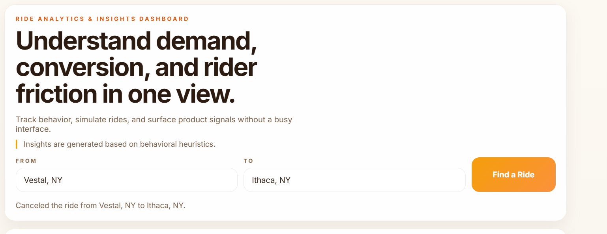
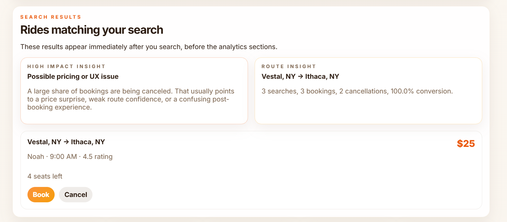
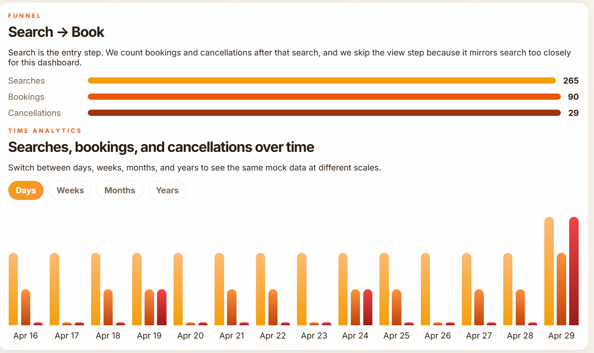
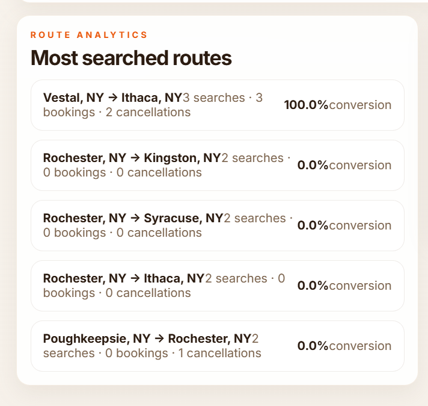

# Ride Analytics & Insights Dashboard

Ride Analytics & Insights Dashboard is a simple full-stack TypeScript system that collects ride-search events and turns them into a live analytics dashboard. The project is built to satisfy the assignment goal of showing how event tracking, aggregation, and visualization can work together in one clean app.

## Overview

The system simulates a ride-sharing product. A user searches for a route, sees matching trips, opens a ride card, books or cancels, and the system records each action as an event. Those events are stored in memory, aggregated on the server, and rendered in the dashboard as metrics, route analysis, trend charts, and heuristic insights.

The goal is not just to store events. The goal is to explain what the events mean so a product or operations team can understand demand, conversion, cancellations, and route-level behavior.

## What The System Does

This repo demonstrates a complete event-to-insight flow:

1. The frontend collects user actions through a search and ride-simulation UI.
2. The backend validates each event and stores it in an in-memory event log.
3. Analytics functions summarize the event stream into useful business metrics.
4. The dashboard displays the results in cards, charts, and route insights.

Because the app ships with seeded mock events, the dashboard is useful immediately after startup instead of showing an empty screen.

## Tech Stack

- Backend: Node.js, Express, TypeScript
- Frontend: React, TypeScript, Vite
- Storage: In-memory event store with seeded demo data
- Shared layer: Common event and ride types in the `shared` folder

## Project Structure

- `client/` contains the React dashboard and API helpers.
- `server/` contains the Express server, event store, and analytics logic.
- `shared/` contains the ride catalog and shared TypeScript types.

## Core Event Model

The system tracks four user actions:

- `search_ride`: created when a user searches from one location to another.
- `view_ride`: created when a user opens a ride card.
- `book_ride`: created when a user books a ride.
- `cancel_ride`: created when a user cancels a ride.

Each event includes a timestamp, and some events include route-specific metadata such as `from`, `to`, `rideId`, and `price`.

These events are sent to `POST /api/events` and can be retrieved later from `GET /api/events`.

## API Endpoints

- `GET /api/catalog/rides` returns the full mock ride catalog.
- `POST /api/events` records a new event.
- `GET /api/events` returns the stored event history.
- `GET /api/analytics/summary` returns high-level totals.
- `GET /api/analytics/funnel` returns search, view, booking, and cancellation funnel data.
- `GET /api/analytics/routes` returns route-level search, booking, and cancellation analytics.
- `GET /api/analytics/top-routes` returns the most searched routes.
- `GET /api/analytics/timeseries` returns trend data by day, week, month, and year.
- `GET /api/insights` returns heuristic insight cards.
- `GET /api/dashboard` returns the full dashboard payload in one request.

## Dashboard Features

### Search And Results

The top of the dashboard contains a search form with autocomplete suggestions. Users can search from and to locations, then immediately see matching ride cards in a dedicated results panel above the analytics sections.

### Ride Simulation

Each ride card supports view, book, and cancel actions. These actions create live events, refresh the dashboard, and update the metrics.

### Metrics

The dashboard shows the overall numbers that matter most:

- Total searches
- Total bookings
- Total cancellations
- Conversion rate
- Cancellation rate

### Funnel Analytics

The funnel section shows the relationship between search, booking, and cancellation activity. In this version, the dashboard focuses on the meaningful business steps and avoids treating `view` as a separate stage because it overlaps too closely with search behavior in the UI.

### Route Analytics

Route analytics show which routes people search most often and whether those routes convert well. This helps identify strong demand, weak conversion, and routes where cancellations are concentrated.

### Time Analytics

The time chart can be viewed by days, weeks, months, and years. The seeded data is spread across all of those periods so the same dashboard can show short-term spikes and long-term patterns.

### Insights

The insights engine highlights behavior patterns using simple heuristics. The dashboard shows:

- One high-impact insight for the overall system
- One route-specific insight for the currently selected or most relevant route

These cards help explain what the data means rather than only showing raw counts.

## Mock Data Design

The mock data is intentionally broad:

- The ride catalog includes trips between every pair of locations.
- Each route has at least one trip so autocomplete and route search feel realistic.
- The seed data covers days, weeks, months, and years.
- Search, view, booking, and cancellation events are all represented.

This matters because analytics only become useful when the underlying data has enough variety to reveal patterns.

## Why The Insights Matter

This dashboard helps answer questions such as:

- Which routes are getting searched the most?
- Are riders opening ride cards but not booking?
- Are cancellations concentrated on certain routes?
- Does demand change by day, week, month, or year?
- Which routes deserve more supply or a better booking flow?

That is the difference between simple event logging and product analytics.

## Screenshots

### 1. Full Dashboard Overview




### 2. Search Results Experience



This view demonstrates how route searches produce immediate ride matches below the search form. It validates the user journey where a search event leads directly to actionable ride options and further interaction events.

### 3. Funnel Analytics



This image highlights the funnel section that compares key behavior stages. It helps explain conversion health by showing how many searches lead to bookings and how cancellations affect outcomes.

### 4. Route Analytics



This screenshot focuses on route-level performance. It is useful for identifying high-demand routes, weaker conversion routes, and places where cancellations may require pricing or UX improvements.

## How To Run

1. Install dependencies.

   ```bash
   npm install
   ```

2. Start development mode.

   ```bash
   npm run dev
   ```

3. Build the project.

   ```bash
   npm run build
   ```

4. Start the production server.

   ```bash
   npm start
   ```

The frontend runs on Vite and proxies `/api` requests to the Express backend during development.

## How To Test The Features

- Search autocomplete: type a few letters into `From` or `To` and confirm the location suggestions appear.
- Search results: run a search and confirm matching ride cards appear directly under the search bar.
- Ride simulation: click a ride card, then use `Book` or `Cancel` to create live events.
- Metrics: perform searches and bookings, then verify the cards at the top update.
- Funnel analytics: compare search, booking, and cancellation counts after using the simulation UI.
- Route analytics: search different route pairs and confirm the top routes list changes.
- Time analytics: switch between days, weeks, months, and years to see the seeded data at different scales.
- Insights: search and book a few routes, then check the route-specific and high-impact insight cards.

## Summary

This repo is a small but complete TypeScript example of an event-driven analytics system. It shows how to collect events, store them simply, aggregate them into meaningful metrics, and present them in a dashboard that explains behavior instead of only recording it.